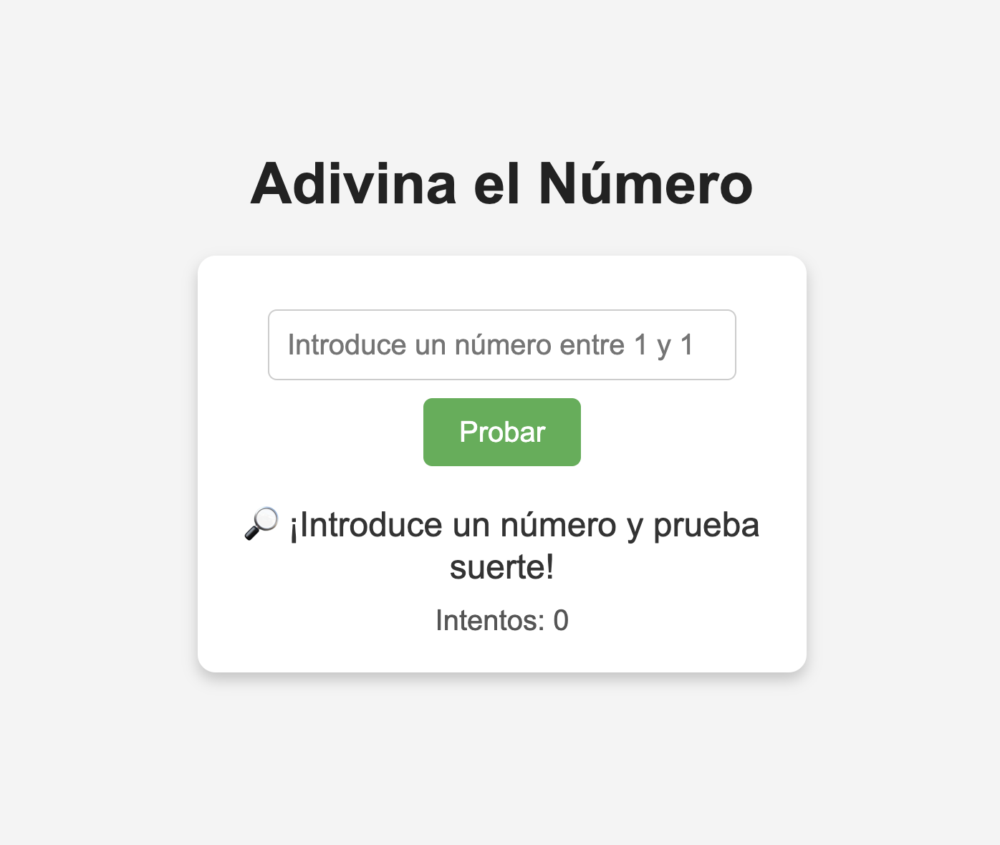

🧠✨ Adivina el Número 🎯
¡Bienvenido al juego de Adivina el Número! 🔢
Pon a prueba tu intuición y habilidades matemáticas para descubrir el número secreto entre 1 y 100.
¿Podrás adivinarlo con el menor número de intentos posible? 😎

🚀 ¿Cómo jugar?
👉 Sigue estos pasos para empezar:

💡 Introduce un número entre 1 y 100.
🎯 Pulsa el botón "Probar" para comprobar si es el número correcto.
🔥 El juego te dará una pista:
⬆️ Demasiado bajo → Prueba con un número más alto.
⬇️ Demasiado alto → Prueba con un número más bajo.
🎉 ¡Has acertado! → Si aciertas, el juego termina.
🔄 ¡Intenta adivinarlo en el menor número de intentos posible!
👀 Captura de pantalla
¡Así se ve el juego en acción! 👇

🛠️ Tecnologías utilizadas
✅ HTML5 → Estructura del juego
✅ CSS3 → Estilo y diseño responsivo
✅ JavaScript → Lógica del juego

🌟 Características
✔️ Diseño simple y elegante
✔️ Lógica de juego intuitiva
✔️ Feedback en tiempo real con pistas
✔️ Contador de intentos

📥 Instalación
Si quieres probar el juego en tu máquina local:

Clona el repositorio
bash
Copiar código
git clone https://github.com/tu-usuario/adivina-el-numero.git
Abre el archivo index.html en tu navegador favorito.
🎮 ¡A jugar!
¿Podrás adivinar el número oculto? ¡Demuéstralo ahora! 😎

👉 ¡Jugar ahora!

🏆 ¡Déjame una estrella ⭐ si te ha gustado!
Si disfrutaste el juego, ¡no olvides dejar una estrella en el repositorio! 🚀